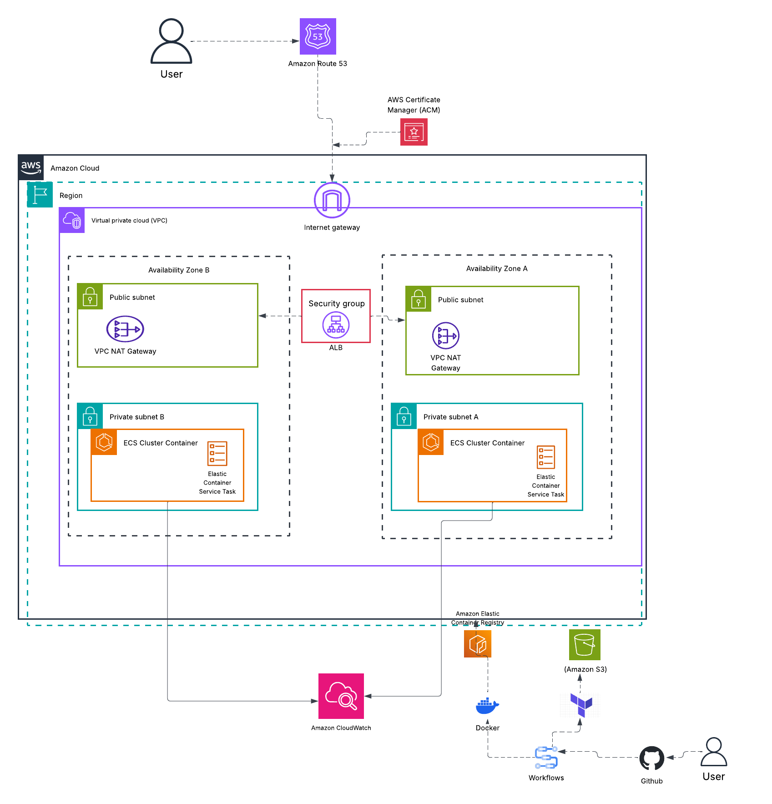

# 🚀 AWS ECS Deployment with Terraform (DevOps Project)

---

## 📑 Table of Contents

1. Overview
2. Architecture
3. Architecture Diagram
4. Technologies Used
5. Features
6. Project Structure
7. Deployment Steps

   * 7.1 Prerequisites
   * 7.2 Application Setup
   * 7.3 Containerisation
   * 7.4 Image Registry (ECR)
   * 7.5 Manual AWS Setup (ClickOps)
   * 7.6 Infrastructure as Code (Terraform)
   * 7.7 CI/CD Automation
8. DevOps Concepts Demonstrated
9. Security Considerations
10. Challenges & Solutions
11. Future Improvements
12. Author

---

## 1. 📌 Overview

This project demonstrates the deployment of a containerised application using **Amazon ECS (Fargate)** with **Terraform** for Infrastructure as Code (IaC). It provisions and configures core AWS services including **Amazon ECR**, **Amazon S3**, networking, and ECS resources.

The solution showcases modern DevOps practices such as automated infrastructure provisioning, container orchestration, and cloud-native deployment using a scalable, serverless architecture.

---

## 2. 🏗️ Architecture

The system consists of:

* Amazon ECS (Fargate) – runs containerised applications without managing servers
* Amazon ECR – stores and manages Docker container images
* Amazon S3 – stores Terraform remote state securely
* IAM Roles – manage secure access between AWS services
* VPC & Networking – enables secure communication between resources

---

## 3. 📊 Architecture Diagram



---

## 4. ⚙️ Technologies Used

* AWS ECS (Fargate)
* AWS ECR
* AWS S3
* Terraform
* Docker
* Git & GitHub

---

## 5. 🚀 Features

* Infrastructure as Code using Terraform
* Bootstrap layer for foundational resources (S3 & ECR)
* Automated provisioning of AWS infrastructure
* Container deployment using ECS Fargate
* Remote Terraform state management
* Scalable and serverless architecture
* Secure IAM-based access control

---

## 6. 📂 Project Structure

```bash
.
├── app/
├── bootstrap/
├── infra/
│   └── modules/
├── .github/workflows/
│   ├── build.yml
│   ├── deploy.yml
│   └── destroy.yml
└── README.md
```

---

## 7. 🔄 Deployment Steps

### 7.1 🔹 Prerequisites

* AWS CLI installed and configured
* Terraform installed
* Docker installed
* AWS account with appropriate IAM permissions

---

### 7.2 🔹 Application Setup

```bash
yarn install
yarn build
yarn global add serve
serve -s build
```

---

### 7.3 🔹 Containerisation

```bash
docker build -t <image-name> ./app
docker run -p 8080:80 <image-name>
curl http://localhost:8080
```

---

### 7.4 🔹 Image Registry (ECR)

```bash
aws sts get-caller-identity

aws ecr get-login-password --region <region> \
| docker login --username AWS --password-stdin <account-id>.dkr.ecr.<region>.amazonaws.com

docker tag <image-name> <repo-uri>
docker push <repo-uri>
```

---

### 7.5 🔹 Manual AWS Setup (ClickOps)

Initial manual setup included:

* ECS Cluster (Fargate)
* Task Definitions
* Application Load Balancer
* Security Groups
* Route53 DNS
* ACM Certificate

All resources were later replaced with Terraform.

---

### 7.6 🔹 Infrastructure as Code (Terraform)

#### Bootstrap

```bash
cd bootstrap
terraform init
terraform apply
```

#### Main Infrastructure

```bash
cd infra
terraform init
terraform plan
terraform apply
```

#### Validation

```bash
curl https://<DOMAIN>
curl https://<DOMAIN>/health
```

#### Destroy

```bash
terraform destroy
```

---

### 7.7 🔹 CI/CD Automation

CI/CD pipelines are implemented using GitHub Actions to automate build, deployment, and teardown processes.

#### 🔹 Build Pipeline (`build.yml`)

* Builds Docker image
* Tags image
* Pushes image to Amazon ECR

#### 🔹 Deploy Pipeline (`deploy.yml`)

* Initializes Terraform
* Applies infrastructure changes
* Deploys latest container image to ECS

#### 🔹 Destroy Pipeline (`destroy.yml`)

* Safely destroys infrastructure
* Requires manual confirmation (`destroy`)
* Prevents accidental deletion

#### 🔹 Key Benefits

* Automated deployments
* Consistent infrastructure provisioning
* Reduced manual errors
* Faster release cycles

---

## 8. 🧠 DevOps Concepts Demonstrated

* Infrastructure as Code (Terraform)
* Containerisation (Docker)
* Cloud provisioning (AWS)
* Remote state management
* CI/CD pipelines
* Modular architecture

---

## 9. 🔐 Security Considerations

* IAM roles instead of hardcoded credentials
* Encrypted S3 backend
* ECR image scanning enabled
* Least privilege access

---

## 10. ❗ Challenges & Solutions

**Terraform backend dependency**
→ Solved using bootstrap layer

**ECS task failures**
→ Fixed IAM roles and image URI

**Networking issues**
→ Corrected subnets and security groups

**ECR authentication issues**
→ Verified login and permissions

**Git conflicts**
→ Used rebase workflow

---

## 11. 📈 Future Improvements

* Blue/Green deployments
* Auto-scaling
* CloudWatch monitoring
* AWS WAF
* Secrets Manager integration

---

## 12. 👨‍💻 Author

Safia Addow
DevOps Engineer
